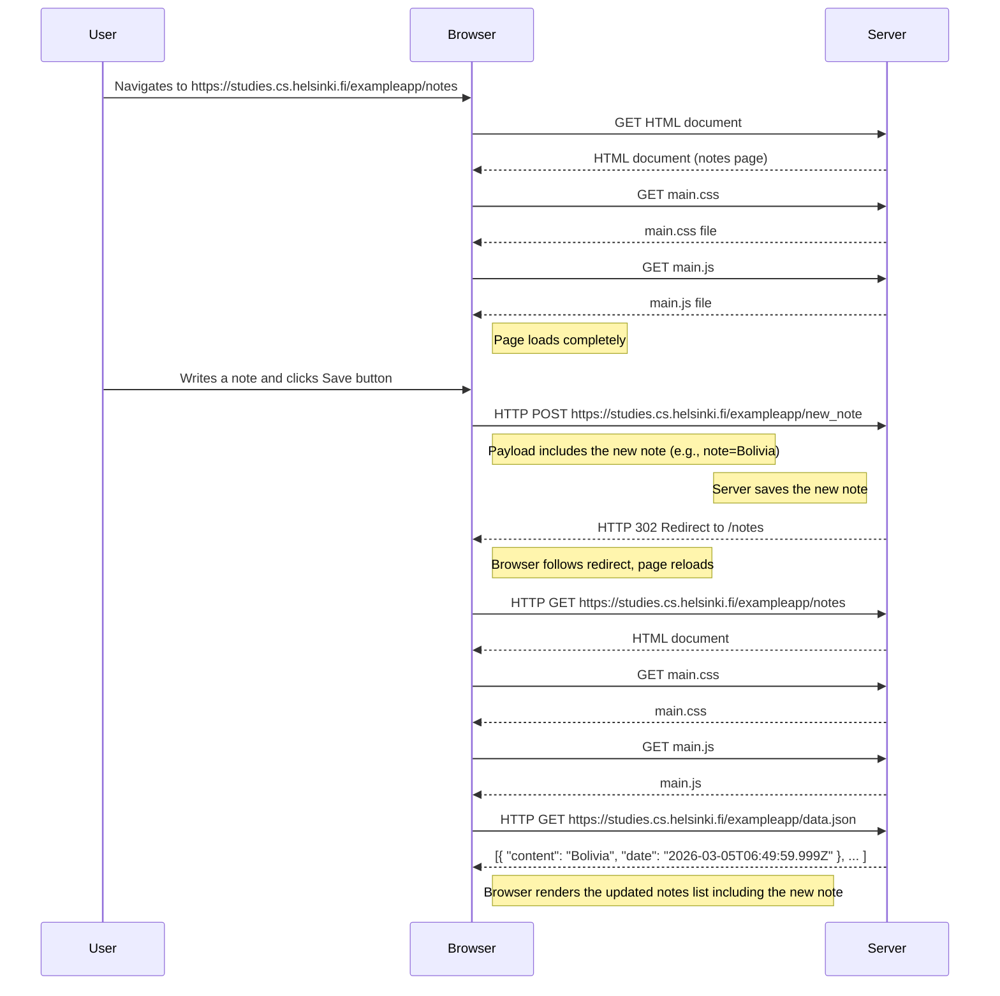

# New Note Creation Diagram - Exercise 0.4

```mermaid
sequenceDiagram
    participant User
    participant Browser
    participant Server

    User->>Browser: Navigates to https://studies.cs.helsinki.fi/exampleapp/notes
    
    Browser->>Server: GET HTML document
    Server-->>Browser: HTML document (notes page)
    
    Browser->>Server: GET main.css
    Server-->>Browser: main.css file
    
    Browser->>Server: GET main.js
    Server-->>Browser: main.js file
    Note right of Browser: Page loads completely

    User->>Browser: Writes a note and clicks Save button

    Browser->>Server: HTTP POST https://studies.cs.helsinki.fi/exampleapp/new_note
    Note right of Browser: Payload includes the new note (e.g., note=Bolivia)
    
    Note left of Server: Server saves the new note
    Server-->>Browser: HTTP 302 Redirect to /notes

    Note right of Browser: Browser follows redirect, page reloads
    Browser->>Server: HTTP GET https://studies.cs.helsinki.fi/exampleapp/notes
    Server-->>Browser: HTML document
    Browser->>Server: GET main.css
    Server-->>Browser: main.css
    Browser->>Server: GET main.js
    Server-->>Browser: main.js

    Browser->>Server: HTTP GET https://studies.cs.helsinki.fi/exampleapp/data.json
    Server-->>Browser: [{ "content": "Bolivia", "date": "2026-03-05T06:49:59.999Z" }, ... ]
    Note right of Browser: Browser renders the updated notes list including the new note
```