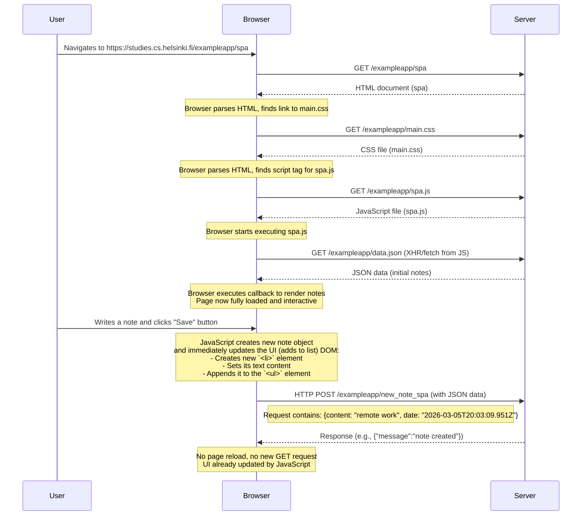

# Single page app diagram - Exercise 0.5

```mermaid
sequenceDiagram
    participant User
    participant Browser
    participant Server

    User->>Browser: Navigates to https://studies.cs.helsinki.fi/exampleapp/spa
    
    Browser->>Server: GET /exampleapp/spa
    Server-->>Browser: HTML document (spa)
    Note over Browser: Browser parses HTML, finds link to main.css
    
    Browser->>Server: GET /exampleapp/main.css
    Server-->>Browser: CSS file (main.css)
    Note over Browser: Browser parses HTML, finds script tag for spa.js
    
    Browser->>Server: GET /exampleapp/spa.js
    Server-->>Browser: JavaScript file (spa.js)
    Note over Browser: Browser starts executing spa.js
    
    Browser->>Server: GET /exampleapp/data.json (XHR/fetch from JS)
    Server-->>Browser: JSON data (initial notes)
    Note over Browser: Browser executes callback to render notes<br/>Page now fully loaded and interactive

    User->>Browser: Writes a note and clicks "Save" button
    Note over Browser: JavaScript creates new note object<br/>and immediately updates the UI (adds to list) DOM:<br/>- Creates new `<li>` element<br/>- Sets its text content<br/>- Appends it to the `<ul>` element
    
    Browser->>Server: HTTP POST /exampleapp/new_note_spa (with JSON data)
    Note right of Browser: Request contains: {content: "remote work", date: "2026-03-05T20:03:09.951Z"}
    
    Server-->>Browser: Response (e.g., {"message":"note created"})
    Note over Browser: No page reload, no new GET request<br/>UI already updated by JavaScript
```