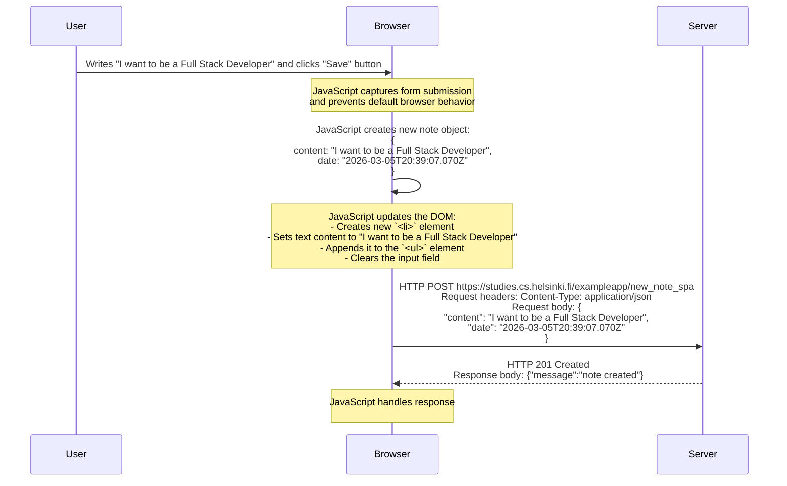

# New note in Single page app diagram - Exercise 0.6

```mermaid
sequenceDiagram
    participant User
    participant Browser
    participant Server

    User->>Browser: Writes "I want to be a Full Stack Developer" and clicks "Save" button
    
    Note over Browser: JavaScript captures form submission<br/>and prevents default browser behavior
    
    Browser->>Browser: JavaScript creates new note object:<br/>{<br/>  content: "I want to be a Full Stack Developer",<br/>  date: "2026-03-05T20:39:07.070Z"<br/>}
    
    Note over Browser: JavaScript updates the DOM:<br/>- Creates new `<li>` element<br/>- Sets text content to "I want to be a Full Stack Developer"<br/>- Appends it to the `<ul>` element<br/>- Clears the input field
    
    Browser->>Server: HTTP POST https://studies.cs.helsinki.fi/exampleapp/new_note_spa<br/>Request headers: Content-Type: application/json<br/>Request body: {<br/>  "content": "I want to be a Full Stack Developer",<br/>  "date": "2026-03-05T20:39:07.070Z"<br/>}
    
    Server-->>Browser: HTTP 201 Created<br/>Response body: {"message":"note created"}
    
    Note over Browser: JavaScript handles response<br/>
```
