# Create folder

1. mkdir part3
2. mkdir E3.1PhonebookBackend

# Git

1. Go to E3.1PhonebookBackend/
2. git checkout -b part3

# Node

1. npm init

- Answer the questions

2. package name e3.1phonebookbackend
3. version: (1.0.0)
4. description: Phonebook backend
5. entry point: index.js
6. test command: ✓ Press enter (to set up testing)
7. git repository: ✓ Press enter (you can leave blank for now, or add it later)
8. keywords: ✓ Press enter (or add something like "express, phonebook, backend")
9. author: your name if you want
10. license: (ISC) ✓ Press Enter to accept default

Is this OK? (yes)
✓ Type "yes" and press Enter

## This creates package.json file

```JavaScript

/*package.json*/
{
  "name": "e3.1phonebookbackend",
  "version": "1.0.0",
  "description": "Phonebook backend",
  "main": "index.js",
  "scripts": {
    "test": "echo \"Error: no test specified\" && exit 1"
  },
  "keywords": [
    "\"express",
    "phonebook",
    "backend\""
  ],
  "author": "Critian Mamani Aguirre",
  "license": "ISC"
}
```

The file defines, for instance, that the entry point of the application is the index.js file.

# Create index.js

1. touch index.js

## Add 'Hello World' index.js

```JavaScript
const http = require('http')

const app = http.createServer((request, response) => {
  response.writeHead(200, { 'Content-Type': 'text/plain' })
  response.end('Hello World')
})

const PORT = 3001
app.listen(PORT)
console.log(`Server running on port ${PORT}`)
```

### Working with the index.js as a script

Let's make a small change to the scripts object by adding a new script command.

```JavaScript
{
// ...
"scripts": {
  "start": "node index.js",  /*<--add this line*/
  "test": "echo \"Error: no test specified\" && exit 1"
},
// ...
}
```

### Run as a script

We can run the program directly with Node from the command line:

```JavaScript
node index.js
```

Or we can run it as an npm script:

```JavaScript
npm start
```

The start npm script works because we defined it in the package.json file:

```JavaScript
{
  // ...
  "scripts": {
    "start": "node index.js",
    "test": "echo \"Error: no test specified\" && exit 1"
  },
  // ...
}
```

Even though the execution of the project works when it is started by calling **node index.js** from the command line, it's customary for npm projects to execute such tasks as npm scripts.

Once the application is running, the following message is printed in the console:

```JavaScript
Server running on port 3001
```

# Open in the browser

By visiting the address http://localhost:3001:
The server works the same way regardless of the latter part of the URL.
Also the address http://localhost:3001/foo/bar will display the same content.

NB If port 3001 is already in use by some other application, then starting the server will result in the following error message:

```JavaScript
➜  hello npm start

> hello@1.0.0 start /Users/mluukkai/opetus/_2019fullstack-code/part3/hello
> node index.js

Server running on port 3001
events.js:167
      throw er; // Unhandled 'error' event
      ^

Error: listen EADDRINUSE :::3001
    at Server.setupListenHandle [as _listen2] (net.js:1330:14)
    at listenInCluster (net.js:1378:12)
```

You have two options. Either shut down the application using port 3001 (the JSON Server in the last part of the material was using port 3001), or use a different port for this application.

# Offer raw data in JSON format to the frontend

Change the server to return a hardcoded list of notes in the JSON format:

```JavaScript
const http = require('http')

let notes = [
  {
    id: "1",
    content: "HTML is easy",
    important: true
  },
  {
    id: "2",
    content: "Browser can execute only JavaScript",
    important: false
  },
  {
    id: "3",
    content: "GET and POST are the most important methods of HTTP protocol",
    important: true
  }
]
const app = http.createServer((request, response) => {
  response.writeHead(200, { 'Content-Type': 'application/json' })
  response.end(JSON.stringify(notes))
})

const PORT = 3001
app.listen(PORT)
console.log(`Server running on port ${PORT}`)
```

The **application/json value** in the **Content-Type header** informs the receiver that _the data is in the JSON format_.

The notes array gets transformed into JSON formatted string with the **JSON.stringify(notes)** method.
This is necessary because the **response.end()** method **expects a string** or a buffer **to send as the response body**.

# Express

- Implementing the server code directly with Node's built-in http web server is possible.
- However, it is cumbersome, especially once the application grows in size.

Many libraries have been developed to ease server-side development with Node, by offering a more pleasing interface to work with the built-in http module.
By far the most popular library intended for this purpose is _Express_.

```JavaScript
 npm install express
```

- It installs node_modules
  These are the dependencies of the Express library and the dependencies of all of its dependencies, and so forth.
  These are called the transitive dependencies of our project.

- The dependency is also added to our package.json file:

```JavaScript
  "dependencies": {
    "express": "^5.2.1"
  }
```

We can update the dependencies of the project with the command:

```JavaScript
npm update
```

Likewise, if we start working on the project on another computer, we can install all up-to-date dependencies of the project defined in package.json by running this next command in the project's root directory:

```JavaScript
npm install
```

# Web and Express

Make the following changes:

At the beginning of the code, we're importing express

```JavaScript
const express = require('express')
const app = express()

let notes = [
  {
    id: "1",
    content: "HTML is easy",
    important: true
  },
  {
    id: "2",
    content: "Browser can execute only JavaScript",
    important: false
  },
  {
    id: "3",
    content: "GET and POST are the most important methods of HTTP protocol",
    important: true
  }
]

app.get('/', (request, response) => {
  response.send('<h1>Hello World!</h1>')
})

app.get('/api/notes', (request, response) => {
  response.json(notes)
})

const PORT = 3001
app.listen(PORT, () => {
  console.log(`Server running on port ${PORT}`)
})
```

To get the new version of our application into use, first we have to restart it.

There are two routes to the application. The first one defines an event handler that is used to handle HTTP GET requests made to the application's / root:

- See Hello World!: http://localhost:3001
- See notes: http://localhost:3001/api/notes

## Response

The request is responded to with the json method of the response object. Calling the method will send the notes array that was passed to it as a JSON formatted string. **Express automatically sets the Content-Type** header with the appropriate value of **application/json**.

Take a quick look at the data sent in JSON format.

In the earlier version using Node, we _had to transform the data into the JSON formatted string with the JSON.stringify_ method:

```JavaScript
response.end(JSON.stringify(notes))
```

With **Express**, _this is no longer required_, because **this transformation happens automatically**.

It's worth noting that JSON is a data format.
However, it's often represented as a string and is not the same as a JavaScript object, like the value assigned to notes.

# Automatic Change Tracking

If we change the application's code, we first need to stop the application from the console (ctrl + c) and then restart it for the changes to take effect.

You can make the server track our changes by starting it with the --watch option:

```JavaScript
node --watch index.js
```

Now, changes to the application's code will cause the server to restart automatically.
Note that although the server restarts automatically, you _still need to refresh the browser_.

Let's define a custom npm script in the package.json file to start the development server:

```JavaScript
{
// ..
"scripts": {
"start": "node index.js",
"dev": "node --watch index.js",     /*<--add this line*/
"test": "echo \"Error: no test specified\" && exit 1"
},
// ..
}
```

We can now start the server in development mode with the command

```JavaScript
npm run dev
```

Unlike when running the _start_ or _test_ scripts, the command must include **_run_**.

# Git

If you use **_git status_** notice that node modules is being tracked

```Bash
Untracked files:
  (use "git add <file>..." to include in what will be committed)
        index.js
        node_modules/
        package-lock.json
        package.json
        set-up.md
```

- Create a .gitignore file

```JavaScript
/*.gitignore file*/
node_modules
```

- Add _node_modules_ **to avoid tracking** _node_modules_
- git status

```Bash
$ git status
On branch part3

No commits yet

Untracked files:
  (use "git add <file>..." to include in what will be committed)
        .gitignore
        index.js
        package-lock.json
        package.json
        set-up.md
```

Now git is not tracking _node modules folder anymore_

## Now add and commit your files:

- Add all files (except those in .gitignore)

```Bash
  git add .
```

- Check what will be committed

```Bash
  git status
```

- Commit them

```Bash
  git commit -m "Initialize phonebook backend with Express"
```

- Push to GitHub

```Bash
  git push -u origin part3
```

# REST

Let's expand our application so that it provides the same RESTful HTTP API as json-server.

Representational State Transfer, aka REST, was introduced in 2000 in Roy Fielding's dissertation. REST is an architectural style meant for building scalable web applications.

In some places you will see our model for a straightforward CRUD API, being referred to as an example of resource-oriented architecture instead of REST.

# Fetching a single resource

We can define parameters for **routes in Express** by using the **colon syntax** - example _'/api/notes/**:id'**_

```bash
app.get('/api/notes/:id', (request, response) => {
  const id = request.params.id
  const note = notes.find(note => note.id === id)
  response.json(note)
})
```

Now app.get('/api/notes/:**id**', ...) will handle all HTTP GET requests that are of the form /api/notes/**SOMETHING**, where SOMETHING is an arbitrary string.

The id parameter in the route of a request can be accessed through the request object:

```JavaScript
const id = request.params.id
```

## Debugging tip

If you're ever unsure what Express is receiving, add:

```JavaScript
console.log(request.params);
```

Then visit:

```bash
http://localhost:3001/api/persons/1
```

You’ll see something like:

```JavaScript
{ id: '1' }
```

Extract the id correctly from **request.params.id**

## handle situation when no data is found

If no note is found, the server should respond with the status code 404 not found instead of 200.

```JavaScript
app.get("/api/persons/:id", (request, response) => {
  const id = request.params.id;
  const person = persons.find((person) => person.id === id);
  if (!person) {
    return response.status(404).end();
  }

  response.json(person);
});
```

This part handles the situation when there is no data.
You could simplify the route slightly by returning early:

```JavaScript
  if (!person) {
    return response.status(404).end();
  }

  response.json(person);
```

Since no data is attached to the response, we use the status method for setting the [status](https://expressjs.com/en/4x/api.html#res.status) and the end method for responding to the request without sending any data.

# Deleting resources

Let's implement a route for deleting resources.
Deletion happens by making an HTTP DELETE request to the URL of the resource:

```JavaScript
app.delete("/api/persons/:id", (request, response) => {
  const id = request.params.id;

  const person = persons.find((person) => person.id === id);
  if (!person) {
    return response.status(404).end();
  }

  const filteredPersons = persons.filter((person) => person.id !== id);
  persons = filteredPersons;
  response.status(204).end();
});
```

If deleting the resource is successful, meaning that the note exists and is removed, we **respond to the request with the status code 204 no content** and return no data with the response.

There's no consensus on what status code should be returned to a DELETE request if the resource does not exist. _The only two options are 204 and 404._ For the sake of simplicity, our application will respond with **204** in both cases.

# Receiving data

Let's make it possible to add new notes to the server.
Adding a note happens by making an HTTP POST request to the address http://localhost:3001/api/persons/ , and by sending all the information for the new note in the request body in JSON format.

To **access** the data easily, we need the **help of the Express json-parser** that we can use with the command **app.use(express.json())**.

Let's activate the json-parser and implement an initial handler for dealing with the HTTP POST requests:

```JavaScript
const express = require('express')
const app = express()

app.use(express.json())    //<-- json-parser

//...

app.post("/api/persons", (request, response) => {
  const person = request.body;
  console.log("Received person:", person); // This will show the parsed JSON
  response.json(person);
});
```

The event handler function can access the data from the body property of the request object.

**_Without the json-parser, the body property would be undefined._**

The **json-parser takes the JSON data of a request, transforms it into a JavaScript object** and **_then attaches it to the body property of the request object_** before the route handler is called.

For the time being, the application does not do anything with the received data besides printing it to the console and sending it back in the response.

## Postman - Add an object to post

Make sure to send the data correctly with **_JSON_** to receive response in **Content-Type as application/json; charset=utf-8**

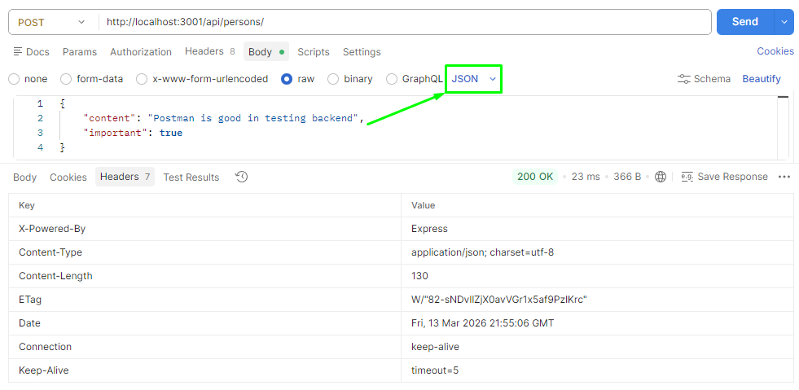

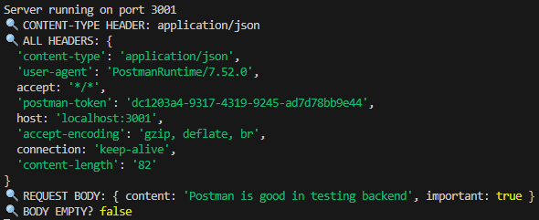

## Rest client - Add an object to post

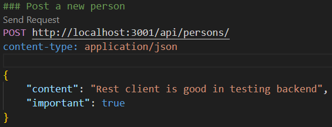

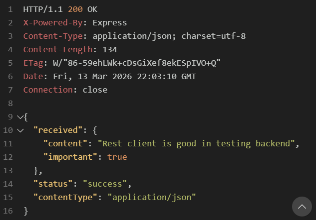

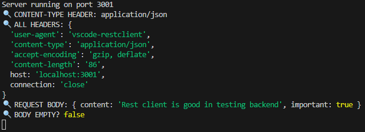

✅ Correct Syntax Rules

```bash
### [Request Name]
[HTTP METHOD] [URL]
[Header1]: [value]
[Header2]: [value]
                                    ← ONE empty line (CRITICAL!)
[Request Body (JSON, text, etc.)]
```

- Common Mistakes to Avoid

❌ Wrong - Empty line before headers

```bash
### Post person
POST http://localhost:3001/api/persons/
                                    ← WRONG: This empty line kills all headers!
content-type: application/json

{
    "name": "John"
}
```

❌ Wrong - No empty line before body

```bash
### Post person
POST http://localhost:3001/api/persons/
content-type: application/json
{                                   ← WRONG: Missing empty line before body!
    "name": "John"
}
```

✅ Correct - Perfect format

```bash
### Post person
POST http://localhost:3001/api/persons/
content-type: application/json
                                    ← RIGHT: One empty line (and only one!)
{
    "name": "John"
}
```

🐛 Debugging Example

#### Backend Debug Code:

```javascript
const express = require("express");
const app = express();

app.use(express.json()); // JSON parser middleware

app.post("/api/persons", (request, response) => {
  // DEBUGGING LINE 1: Check if headers are received
  console.log("🔍 CONTENT-TYPE HEADER:", request.headers["content-type"]);

  // DEBUGGING LINE 2: Check all headers received
  console.log("🔍 ALL HEADERS:", request.headers);

  // DEBUGGING LINE 3: Check the body
  console.log("🔍 REQUEST BODY:", request.body);

  // DEBUGGING LINE 4: Check if body is empty
  console.log("🔍 BODY EMPTY?", Object.keys(request.body).length === 0);

  // Send response
  response.json({
    received: request.body,
    status: "success",
    contentType: request.headers["content-type"],
  });
});
```

🎯 Test Scenarios

### Test 1: Correct Request ✅

```bash
### TEST 1 - Correct format
POST http://localhost:3001/api/persons/
content-type: application/json

{
    "name": "Cris",
    "role": "developer"
}
```

Server Output:

```text
🔍 CONTENT-TYPE HEADER: application/json
🔍 ALL HEADERS: { host: 'localhost:3001', 'content-type': 'application/json', ... }
🔍 REQUEST BODY: { name: 'Cris', role: 'developer' }
🔍 BODY EMPTY? false
```

### Test 2: Wrong Format (Empty line before headers) ❌

```bash
### TEST 2 - Wrong format (empty line before headers)
POST http://localhost:3001/api/persons/
#<-- clear this empty line if you want this test to be right
content-type: application/json

{
    "name": "Cris",
    "role": "developer"
}
```

Server Output:

```text
🔍 CONTENT-TYPE HEADER: undefined
🔍 ALL HEADERS: { host: 'localhost:3001' }  ← Notice: no content-type!
🔍 REQUEST BODY: {}
🔍 BODY EMPTY? true
```

💡 **Quick Troubleshooting Guide**

| Symptom                       | Cause                     | Fix                                        |
| :---------------------------- | :------------------------ | :----------------------------------------- |
| `request.body` is `{}`        | No content-type header    | Check empty line after URL                 |
| `request.body` is `undefined` | JSON parser not working   | Ensure `app.use(express.json())` is called |
| Headers show but body empty   | Wrong content-type        | Use `application/json` exactly             |
| Parser not working            | Empty line before headers | Remove empty line between URL and headers  |

✅ **The golden rule: Headers right after URL, ONE empty line, then body!**

# Important sidenote when debugging

**_Sometimes when you're debugging_**, you may want to find out what **headers** have been set in the HTTP request. One way of **accomplishing** this is through the **get method of the request object**, **_that can be used for getting the value of a single header_**. The request object also has the headers property, that contains all of the headers of a specific request.

**NB:** Sometimes in the console there will be cached data due to by node --watch (try **stopping and restarting**)

# Postman

Install the Postman desktop client and try it out.

Postman is also available on VS Code which can be downloaded from the

- Extension tab on the left -> search for Postman -> First result (Verified Publisher) -> Install [Link](https://marketplace.visualstudio.com/items?itemName=Postman.postman-for-vscode)

You will then see an extra icon added on the activity bar below the extensions tab. Once you log in, you can follow the steps below

# The Visual Studio Code REST client

Install this extension in Visual Studio Code [REST client](https://marketplace.visualstudio.com/items?itemName=humao.rest-client)

🚀 How to Use

- Save the file with a .http or .rest extension

- Start your server: Make sure your backend is running on port 3001

- Click "Send Request" above each request, or use Ctrl+Alt+R

- View responses in the side panel that opens

```bash
### Get root endpoint
Send Request
GET http://localhost:3001/

### Get all persons
Send Request
GET http://localhost:3001/api/persons

### Get info page
Send Request
GET http://localhost:3001/info

### Get person with ID 1
Send Request
GET http://localhost:3001/api/persons/1

### Get person with ID 10 (likely non-existent)
Send Request
GET http://localhost:3001/api/persons/10
```

# About HTTP request types

## Safety (Safe requests):

A safe request should not change anything on the server (no side effects like modifying a database).

GET and HEAD requests are intended to be safe.

GET retrieves data that already exists.

HEAD works like GET but returns only the status code and headers, no response body.

Safety is a recommendation in the HTTP standard, not something guaranteed.

## Idempotency (Idempotent requests):

A request is idempotent if sending it multiple times produces the same result as sending it once.

GET, HEAD, PUT, and DELETE should be idempotent.

Example: Sending the same PUT request multiple times updates the resource to the same final state.

### POST requests:

**_POST is neither safe nor idempotent._**

Sending the same POST request multiple times can create multiple new resources.

✅ Key idea:

**_Safe:_** No server state change.

**_Idempotent:_** Repeating the request doesn’t change the final result.

**_POST:_** Only method that is **_not safe and not idempotent._**

# Middleware

## What is Middleware?

Middleware are **functions that handle request and response objects** in an Express server.

## JSON Parser Middleware

- Takes **raw data from requests**.
- **Parses it into a JavaScript object**.
- Stores the result in **`request.body`**.

## Execution Order

- Multiple middlewares can be used in an application.
- They run **in the order they are declared in the code**.

## Middleware Function Structure

Middleware functions receive **three parameters**:

- `request`
- `response`
- `next`

`next()` is called to **pass control to the next middleware**.

Example:

```javascript
const requestLogger = (request, response, next) => {
  console.log("Method:", request.method);
  console.log("Path:", request.path);
  console.log("Body:", request.body);
  console.log("---");
  next();
};
```

# Morgan middleware

[npm](https://www.npmjs.com/package/morgan)
[github](https://github.com/expressjs/morgan)

**_HTTP request logger middleware for node.js_**

## Installation

This is a Node.js module available through the npm registry. Installation is done using the npm install command:

```bash
 npm install morgan
```

## Hot to import

- API

```JavaSript
const morgan = require('morgan')
```

### morgan(format, options)

Create a new morgan logger middleware function using the given format and options. The format argument may be a string of a predefined name (see below for the names), a string of a format string, or a function that will produce a log entry.

The format function will be called with three arguments tokens, req, and res, where tokens is an object with all defined tokens, req is the HTTP request and res is the HTTP response. The function is expected to return a string that will be the log line, or undefined / null to skip logging.

#### Using a predefined format string

```JavaScript
app.use(morgan('tiny'))
```

Then you will see in the console the tiny format that morgan gives to the log

#### Using a format string of predefined tokens

```javascript
morgan(":method :url :status :res[content-length] - :response-time ms");
```

Morgan provides predefined tokens such as:

- `:method`
- `:url`
- `:status`
- `:res[content-length]`
- `:response-time`

#### Custom Morgan tokens

You can define custom tokens using `morgan.token()` and then use them
inside the format string.

Example:

```javascript
morgan.token("body", (req) => {
  if (req.method === "POST") {
    return JSON.stringify(req.body);
  }
  return "";
});

app.use(
  morgan(":method :url :status :res[content-length] - :response-time ms :body"),
);
```

### Using a custom format function

```JavaScript
morgan(function (tokens, req, res) {
  return [
    tokens.method(req, res),
    tokens.url(req, res),
    tokens.status(req, res),
    tokens.res(req, res, 'content-length'), '-',
    tokens['response-time'](req, res), 'ms'
  ].join(' ')
})
```

Note that logging data even in the console can be dangerous since it can contain sensitive data and may violate local privacy law (e.g. GDPR in EU) or business-standard. In this exercise, you don't have to worry about privacy issues, but in practice, try not to log any sensitive data.

# ⭐ Clean Structure Example (conceptually)

Your file should look like:

```bash
imports
app initialization
middleware
routes
app.listen
```

# Run as a script or as a development

- Run as a script with 'npm start'
- Add development mode with 'npm run dev'

```bash
PS D:\HelsinkiUniversityFullStack\part3\E3.1PhonebookBackend> npm start

> e3.1phonebookbackend@1.0.0 start
> node index.js

Server running on port 3001
PS D:\HelsinkiUniversityFullStack\part3\E3.1PhonebookBackend> npm run dev

> e3.1phonebookbackend@1.0.0 dev
> node --watch index.js

Server running on port 3001
```

# Deploying app to internet

Let's connect the frontend to the backend.

## Same-Origin Policy and CORS

## Overview

Modern browsers enforce a security rule called the Same-Origin Policy (SOP) to protect users from malicious websites accessing sensitive data from other domains.

When building web applications with separate frontend and backend servers, this policy often blocks requests between them unless Cross-Origin Resource Sharing (CORS) is configured correctly.

This section explains:

- What an origin is

- How Same-Origin Policy works

- Why CORS errors occur

- How to enable CORS in a Node.js backend

# What is an Origin?

An origin is defined by the combination of three components:

| Component | Example                  |
| --------- | ------------------------ |
| Protocol  | `http` / `https`         |
| Hostname  | `example.com`            |
| Port      | `80`, `443`, `5173`, etc |

Example URL:

```bash
http://example.com:80/index.html
```

Origin breakdown:

```bash
Protocol: http
Host: example.com
Port: 80
```

If **any of these three values differ**, the origin is considered different.

## Same-Origin Policy

The **Same-Origin Policy** prevents scripts on one website from interacting with resources from another origin.

**Example**

```bash
Frontend: http://localhost:5173
Backend:  http://localhost:3001
```

Even though both run on `localhost`, they have **different ports**, which means **different origins.**

As a result, browsers will **block API requests** from the frontend to the backend unless the server explicitly allows it.

## Request Flow (Without CORS)

```mermaid
SequenceDiagram
participant Browser
participant Frontend
participant Backend

Browser->>Frontend: Load application
Frontend->>Backend: API request (different origin)
Backend-->>Frontend: Response
Browser-->>Frontend: Block response (CORS error)
```

The browser blocks the response because the backend **did not allow cross-origin access.**

## Cross-Origin Resource Sharing (CORS)

**CORS** is a mechanism that allows servers to specify which external origins are permitted to access their resources.

This is done through HTTP response headers.

Important header:

```
Access-Control-Allow-Origin
```

Possible values:

| Value                | Meaning                                    |
| -------------------- | ------------------------------------------ |
| `*`                  | Allow requests from any origin             |
| `http://example.com` | Allow requests only from a specific origin |

## Request Flow (With CORS Enabled)

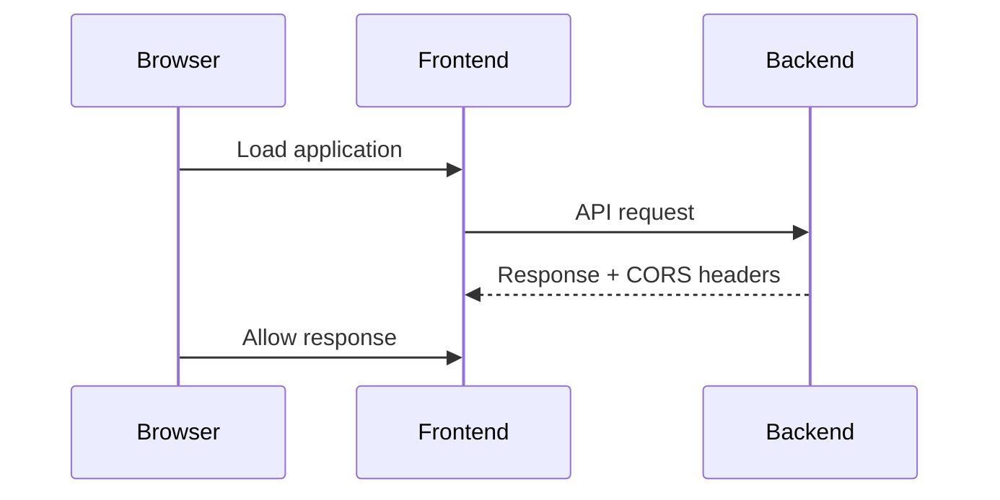

Because the backend includes the correct CORS headers, the browser allows the response.

## Enabling CORS in Node.js (Express)

### 1. Install the CORS middleware

```bash
npm install cors
```

### 2. Enable CORS globally

```JavaScript
const cors = require('cors')

app.use(cors())
```

This allows requests from **all origins.**

## Restricting CORS to Specific Origins (Recommended)

In production environments, it is safer to allow only trusted origins.

Example configuration:

```JavaScript
const cors = require('cors')

app.use(
  cors({
    origin: 'http://localhost:5173'
  })
)
```

This configuration allows requests **only from the specified frontend application.**

**Key Takeaways**

- **Same-Origin Policy** protects users by blocking cross-origin requests.

- Different **protocol, host, or port** means a different origin.

- **CORS** allows servers to explicitly permit cross-origin requests.

- In **Node.js/Express**, the cors middleware is the easiest way to enable it.

- In **production**, restrict CORS to specific trusted origins.

# Frontend–Backend Integration

At this stage, most features in the frontend are functional. The React application successfully communicates with the backend API and retrieves notes.

One feature is still incomplete:

- **Changing the importance of notes**

The backend endpoint responsible for updating note importance has not yet been implemented. As a result, this functionality is currently unavailable in the frontend and will be implemented later.

## Application Architecture

The application follows a client–server architecture:

- The **React frontend** runs in the browser.

- The **Node.js / Express backend** runs locally on a separate port.

- The frontend communicates with the backend through HTTP requests.

### Architecture Diagram

flowchart LR

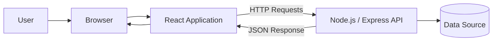

### Development Environment

```bash
Frontend: http://localhost:5173
Backend:  http://localhost:3001
```

Because these services run on **different ports**, the browser treats them as **different origins**, which is why **CORS must be enabled** on the backend.

For more information about CORS, see the documentation from the
Mozilla Developer Network.

### Deploying the Application

Once the full stack is working locally, the next step is to **deploy the application to the internet** so it can be accessed publicly.

There are many services that allow developers to host applications online. Many of these platforms are **PaaS (Platform as a Service)** providers.

PaaS platforms typically handle:

- Server infrastructure
- Runtime environments (such as Node.js)
- Scaling and networking
- Optional services like databases

This allows developers to focus on building the application rather than managing infrastructure.

### Hosting Platforms

Several services can host Node.js applications. Some popular options include:

#### Render

Render offers a free compute tier, making it a good choice for learning and small projects.
It also provides a simple deployment process and does not require additional local installations.

#### Fly.io

Fly.io offers more flexibility and advanced deployment features. However, it has recently moved toward a paid pricing model.

### Other Platforms

Some developers also use:

- Replit
- CodeSandbox

These platforms allow you to run and share Node.js applications directly from the browser.

### Configuring the Application Port

When deploying to cloud platforms, the application cannot always use a **fixed port** like `3001`.

Most hosting providers assign the port dynamically using an **environment variable.**

To support this, update the server configuration in `index.js`:

```JavaScript
const PORT = process.env.PORT || 3001

app.listen(PORT, () => {
  console.log(`Server running on port ${PORT}`)
})
```

#### How This Works

| Variable           | Purpose                                    |
| ------------------ | ------------------------------------------ |
| `process.env.PORT` | Port assigned by the hosting platform      |
| `3001`             | Default port used during local development |

This configuration ensures that:

- The app works **locally during development**

- The app works **correctly in cloud deployment environments**

### Deployment Flow

flowchart LR

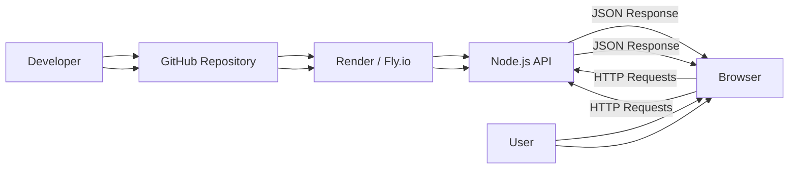

### Summary

- The React frontend communicates with a **Node.js/Express backend API.**

- During development, the frontend and backend run **on different ports.**

- **CORS must be enabled** to allow cross-origin requests.

- For deployment, the server must use a **dynamic port** provided by the hosting platform.

- Platforms like **Render** and **Fly.io** simplify application deployment.

# Deploying the Backend with Render

This project can be deployed using Render, a cloud platform that allows you to host web services directly from a GitHub repository.

⚠️ Note: In some cases, Render may require credit card verification to activate services, even when using the free tier.

---

## Prerequisites

Before deploying, make sure that:

- The backend code is pushed to a GitHub repository
- The repository is **public**
- The backend server runs correctly locally

---

### 1. Sign in to Render

Sign in to Render using your GitHub account.

Once logged in, open the **dashboard** and create a new service.

**Dashboard → New → Web Service**

### 2. Connect the GitHub Repository

Render will prompt you to select a repository from your GitHub account.

Steps:

**1.** Select the backend repository

**2.** Authorize Render to access the repository

**3.** Confirm the connection

Note: In some cases, the repository must be **public** for Render to access it.

### 3. Configure the Web Service

Next, configure the basic settings for the deployment.

Typical configuration:

| Setting       | Value           |
| ------------- | --------------- |
| Environment   | Node            |
| Build Command | `npm install`   |
| Start Command | `node index.js` |

If your backend is located in a **subfolder of the repository**, specify the path in:

```bash
Root Directory
```

Otherwise, leave this field empty.

### 4. Deploy the Application

After configuration, click **Create Web Service**.

Render will:

**1.** Clone the repository

**2.** Install dependencies

**3.** Start the Node.js server

Once deployment finishes, Render provides a **public URL** where the backend API is available.

Example:

```bash
https://your-app-name.onrender.com
```

The dashboard displays:

- Application status
- Deployment history
- Public service URL

### Automatic Deployments

By default, Render automatically redeploys the application whenever a new commit is pushed to the GitHub repository.

However, automatic deployment may occasionally fail.

In that case, the service can be redeployed manually.

#### Manual Redeploy

From the Render dashboard:

```bash
Deploy → Deploy latest commit
```

This forces the application to rebuild and restart using the most recent code.

### Viewing Application Logs

Render provides access to application logs directly in the dashboard.

Logs are useful for debugging:

- server startup
- incoming requests
- runtime errors

Navigate to:

```bash
Dashboard → Logs
```

Typical log output may look like:

```bash
Server running on port 10000
```

This indicates that the hosting environment assigned the application a **dynamic port**.

### Configuring the Server Port

Cloud hosting platforms assign ports dynamically using environment variables.

To support this, the backend server must use the following configuration:

```javascript
const PORT = process.env.PORT || 3001;

app.listen(PORT, () => {
  console.log(`Server running on port ${PORT}`);
});
```

**How It Works**

| Variable           | Purpose                                  |
| ------------------ | ---------------------------------------- |
| `process.env.PORT` | Port assigned by the hosting environment |
| `3001`             | Default port for local development       |

This configuration ensures that:

- The application runs locally during development
- The application runs correctly when deployed to Render

### Deployment Architecture

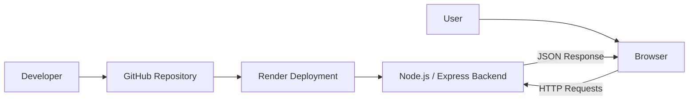

- Render deploys applications directly from a GitHub repository
- Every commit can trigger an automatic redeployment
- Logs can be viewed from the Render dashboard
- The server must use process.env.PORT for compatibility with cloud environments

# Frontend Production Build

So far the React application has been running in **development mode**.  
Development mode provides helpful features such as:

- detailed error messages
- fast refresh when code changes
- debugging tools

However, development mode is **not optimized for deployment**. Before deploying the application, we must create a **production build**.

---

## Creating the Production Build

For applications created with **Vite**, a production build can be generated with the following command:

```bash
npm run build
```

Run this command from the **root directory of the frontend project.**

After running the build command, Vite creates a new directory:

```bash
dist/
```

This directory contains the optimized version of the application.

## JavaScript Bundling and Minification

During the build process:

- All application JavaScript files are **bundled together**
- Dependencies are **included in the bundle**
- The code is **minified and optimized**

Even if the project originally contains multiple JavaScript files, the build process typically generates **one optimized JavaScript bundle.**

Minification removes:

- whitespace
- comments
- long variable names

This reduces the **file size** and improves **application performance.**

Example of minified code:

```javascript
!function(e){function r(r){for(var n,f,i=r[0],l=r[1],a=r[2],c=0,s=[];c<i.length;c++)f=i[c],o[f]&&s.push(o[f][0]),o[f]=0;for(n in l)Object.prototype.hasOwnProperty.call(l,n)&&(e[n]=l[n]);
```

Minified code is intentionally **hard to read** but significantly **smaller and faster** to load in the browser.

# Serving Static Files from the Backend

One common way to deploy a full-stack application is to **serve the frontend build directly from the backend**.  
This means the backend will handle:

- API requests
- Serving the frontend application

---

### 1. Copy the Frontend Production Build

After creating the frontend production build (`dist` folder), copy it into the backend project.

From the **frontend project directory**, run:

```bash
cp -r dist ../backend
```

If you are using Windows, you can use:

```bash
copy
```

or

```bash
xcopy
```

Alternatively, you can simply **copy and paste the `dist` folder** into the backend directory.

#### Backend Project Structure

After copying the build, the backend project should look like this:

```bash
backend/
│
├── dist/
│   ├── index.html
│   └── assets/
│
├── index.js
├── package.json
```

### 2. Configure Express to Serve Static Files

Express includes a built-in middleware for serving static files.

Add the following line in your backend configuration (usually in index.js):

```javascript
app.use(express.static("dist"));
```

This middleware tells Express to serve files from the `dist` directory.

**How It Works**

When the server receives a **GET request**, Express will:

1. Check if the requested file exists inside dist
2. If it exists → return the file
3. Otherwise → continue processing other routes (such as API endpoints)

**Example Routes**
| Request | Handled By |
| ------------- | --------------------- |
| `/` | React frontend |
| `/index.html` | React frontend |
| `/assets/...` | React frontend assets |
| `/api/notes` | Backend API |

### 3. Use Relative API URLs in the Frontend

Since the frontend and backend now run from **the same server**, the frontend can use **relative URLs**.

Example service file:

```JavaScript
import axios from 'axios'

const baseUrl = '/api/notes'

const getAll = () => {
  const request = axios.get(baseUrl)
  return request.then(response => response.data)
}
```

This removes the need to specify:

```bash
http://localhost:3001
```

### 4. Rebuild the Frontend

After updating the frontend code, you must:

- Build the frontend again
- Copy the new dist folder to the backend

```bash
npm run build
```

Then copy the updated dist folder to the backend directory.

#### Running the Application

Start the backend server:

```bash
node index.js
```

The full application is now available at:

```bash
http://localhost:3001
```

### What Happens When the App Loads

- The browser navigates to:

```bash
http://localhost:3001
```

- The server returns:

```bash
dist/index.html
```

Example structure of the HTML file:

```html
<!doctype html>
<html lang="en">
  <head>
    <meta charset="UTF-8" />
    <meta name="viewport" content="width=device-width, initial-scale=1.0" />

    <script type="module" src="/assets/index.js"></script>
    <link rel="stylesheet" href="/assets/index.css" />
  </head>
  <body>
    <div id="root"></div>
  </body>
</html>
```

This file instructs the browser to load:

- the CSS styles
- the JavaScript bundle containing the React application

#### Application Request Flow

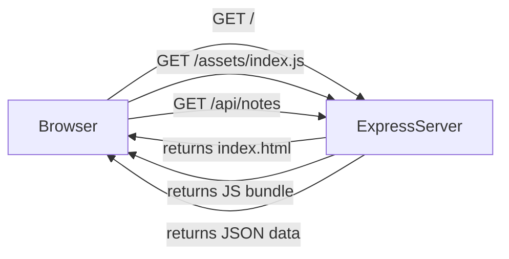

### Final Deployment Architecture

In production, both frontend and backend run inside the **same Node.js server.**

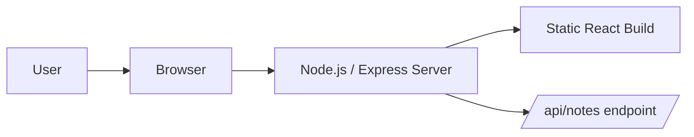

Workflow:

1. Browser loads index.html
2. Browser downloads the React production bundle
3. React application starts
4. React fetches data from:

```bash
/api/notes
```

The backend returns JSON data, and React renders the notes in the UI.

# Deploying the Full Application

After confirming that the **production version works locally**, the next step is to deploy the entire application to the internet.

This deployment includes:

- the **Node.js / Express backend**
- the **React production build (`dist`)**
- the **API endpoints**

---

### 1. Push the Project to GitHub

Commit the latest changes and push them to your repository on GitHub.

```bash
git add .
git commit -m "Prepare production build"
git push
```

⚠️ **Important:** Ensure that the dist directory is not ignored in the backend .gitignore file.

If `dist` is ignored, remove it from `.gitignore`.

Example `.gitignore` (backend):

```bash
node_modules
.env
```

### 2. Deploy with Render

Once the changes are pushed to GitHub, the hosting service will deploy the application.

Typical workflow with Render:

1. Render detects a new commit
2. Render pulls the latest code
3. Dependencies are installed
4. The Node.js server starts

If automatic deployment does not trigger, you can redeploy manually.

**Manual Deployment**

From the Render dashboard:

```bash
Deploy → Deploy latest commit
```

### 3. Access the Deployed Application

After deployment finishes, the application will be available at a public URL.

Example:

```bash
https://your-app-name.onrender.com
```

When visiting this URL:

1. The server returns index.html from the dist directory
2. The browser loads the React production bundle
3. The React application starts
4. React fetches data from the backend API

**Current Application Status**

The application works correctly, except for one missing feature changing the importance of a note is not implemented yet.

The backend currently does not contain the endpoint required to update the importance field. This functionality will be added later.

**Data Persistence**

At the moment, notes are stored in a **temporary in-memory** variable inside the backend server.

Example:

```javascript
let notes = [];
```

This means:

- If the server restarts
- If the application crashes
- If the hosting platform redeploys

All stored notes will be lost.

To solve this, the application will later be connected to a **database.**

### Production Architecture

After deployment, the system architecture looks like this:

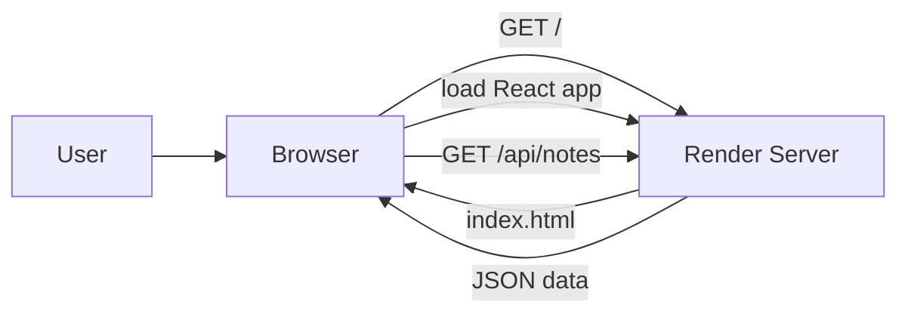

**Application Flow**

- The user navigates to the deployed URL.
- The server returns the React frontend (index.html).
- The browser loads the JavaScript bundle.
- The React application starts.
  React requests data from:

```bash
/api/notes
```

- The backend returns the JSON data.
- The frontend renders the notes.

**Deployment Summary**

- The frontend build (dist) is served by the backend.
- The backend runs on a cloud server (Render).
- The React application communicates with the backend via REST API endpoints.
- Data is currently stored in memory, so it is not persistent.
- A database will be introduced later to store notes permanently.

# Streamlining Frontend Deployment

To simplify the deployment workflow, we can automate the process of **building the frontend and copying it to the backend**.

This avoids manually running multiple commands every time the frontend changes.

The automation can be done by adding **npm scripts** to the backend `package.json`.

---

## Important (Render Deployment)

When deploying to Render, it is recommended to:

- Keep the **backend in a separate GitHub repository**
- Deploy that **backend repository directly through Render**

Attempting to deploy directly from a larger course repository (for example a Fullstackopen monorepo) may cause errors such as: `ERR path ... package.json`

## Backend `package.json` Scripts

Add the following scripts to the backend `package.json`, in case of Render, the scripts look like the following

```json
{
  "scripts": {
    "build:ui": "rm -rf dist && cd ../frontend && npm run build && cp -r dist ../backend",
    "deploy:full": "npm run build:ui && git add . && git commit -m uibuild && git push"
  }
}
```

## Script Explanation

`build:ui`

```bash
npm run build:ui
```

This script:

1. Removes the old production build
2. Moves to the frontend directory
3. Builds the frontend
4. Copies the new dist folder into the backend

Steps executed internally:

```bash
rm -rf dist
cd ../frontend
npm run build
cp -r dist ../backend
```

`deploy:full`

```bash
npm run deploy:full
```

This script performs the **full deployment workflow**:

1. Builds the frontend
2. Copies the production build to the backend
3. Commits the changes
4. Pushes the changes to GitHub

Steps executed internally:

```bash
npm run build:ui
git add .
git commit -m uibuild
git push
```

Once the code is pushed, Render will automatically **redeploy the application.**

**Directory Structure Requirement**

These scripts assume the following directory structure:

```bash
project/
│
├── frontend/
│
└── backend/
```

Example:

```bash
fullstack-project
│
├── frontend
│   └── dist
│
└── backend
    ├── index.js
    └── package.json
```

If your directory structure is different, the paths in the scripts must be adjusted.

**Windows Compatibility**

On Windows, npm scripts run using **cmd.exe** by default.

Commands such as:

```bash
rm
cp
```

are **Bash commands** and may not work.

To enable Bash scripts, set the default npm shell to **Git Bash**:

```bash
npm config set script-shell "C:\\Program Files\\git\\bin\\bash.exe"
```

**Alternative: Using `shx`**

Another option is to install **shx**, which provides cross-platform shell commands.

Install:

```bash
npm install shx
```

Then replace commands such as:

```bash
rm -rf dist
cp -r dist ../backend
```

with their `shx` equivalents.

**Deployment Workflow Summary**

With these scripts, the deployment process becomes:

```bash
npm run deploy:full
```

Which automatically:

1. Builds the React frontend
2. Copies the build to the backend
3. Commits the changes
4. Pushes the update to GitHub
5. Triggers a new deployment on Render

# Proxy Configuration for Development

After changing the frontend API URL to a **relative path**, the frontend may stop working in development mode.

Example change:

```javascript
const baseUrl = "/api/notes";
```

## Problem in Development Mode

When running the frontend with:

```bash
npm run dev
```

the development server runs at:

```bash
http://localhost:5173
```

Since the API URL is relative (`/api/notes`), the browser sends requests to:

```bash
http://localhost:5173/api/notes
```

However, the backend server actually runs at:

```bash
http://localhost:3001
```

As a result, the request fails and the browser shows errors such as:

```bash
404 Not Found
```

## Solution: Configure a Vite Proxy

If the project was created with **Vite**, this problem can be solved by adding a **proxy configuration**.

Update the `vite.config.js` file in the frontend project.

```javascript
import { defineConfig } from "vite";
import react from "@vitejs/plugin-react";

export default defineConfig({
  plugins: [react()],
  server: {
    proxy: {
      "/api": {
        target: "http://localhost:3001",
        changeOrigin: true,
      },
    },
  },
});
```

## How the Proxy Works

With this configuration:

- Requests starting with `/api` are forwarded to the backend server.
- Other requests are handled normally by the Vite development server.

Example request flow:

| Frontend Request                  | Forwarded To                      |
| --------------------------------- | --------------------------------- |
| `http://localhost:5173/api/notes` | `http://localhost:3001/api/notes` |
| `http://localhost:5173/`          | handled by Vite dev server        |

## Restart the Development Server

After updating the configuration, restart the frontend server:

```bash
npm run dev
```

Now the frontend works correctly in **development mode**.

## Removing CORS Middleware

Because the development proxy makes requests appear as if they come from the same origin (`localhost:5173`), the backend no longer needs the **CORS middleware**.

Remove CORS from the backend.

**Remove the dependency**

```bash
npm remove cors
```

**Remove CORS from `index.js`**

Delete code such as:

```javascript
const cors = require("cors");
app.use(cors());
```

## Final Result

The application now works correctly in both environments:

| Mode        | Frontend         | Backend          |
| ----------- | ---------------- | ---------------- |
| Development | `localhost:5173` | `localhost:3001` |
| Production  | Same server      | Same server      |

## Development Architecture

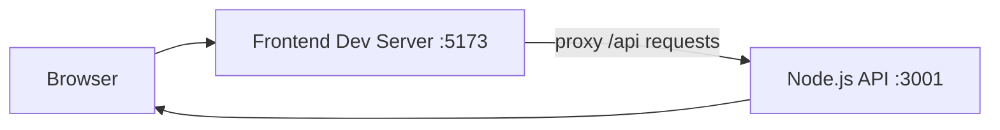

## Production Architecture

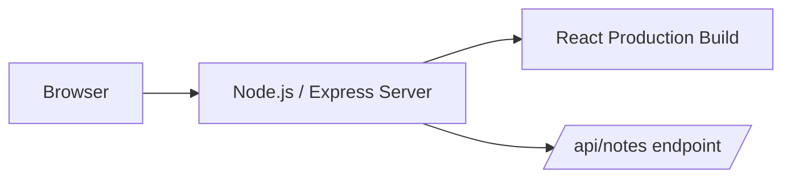

In production:

1. The backend serves the React build.
2. The React application loads in the browser.
3. API requests are sent directly to `/api/notes`.

## Deployment Notes

There are multiple strategies for deploying full-stack applications. In some cases, the frontend may be deployed as a **separate application**, which can simplify automated deployment pipelines.

A **deployment pipeline** is an automated process that moves code from development to production through stages such as:

- building
- testing
- quality checks
- deployment

Automated deployment pipelines are discussed later in the course.
